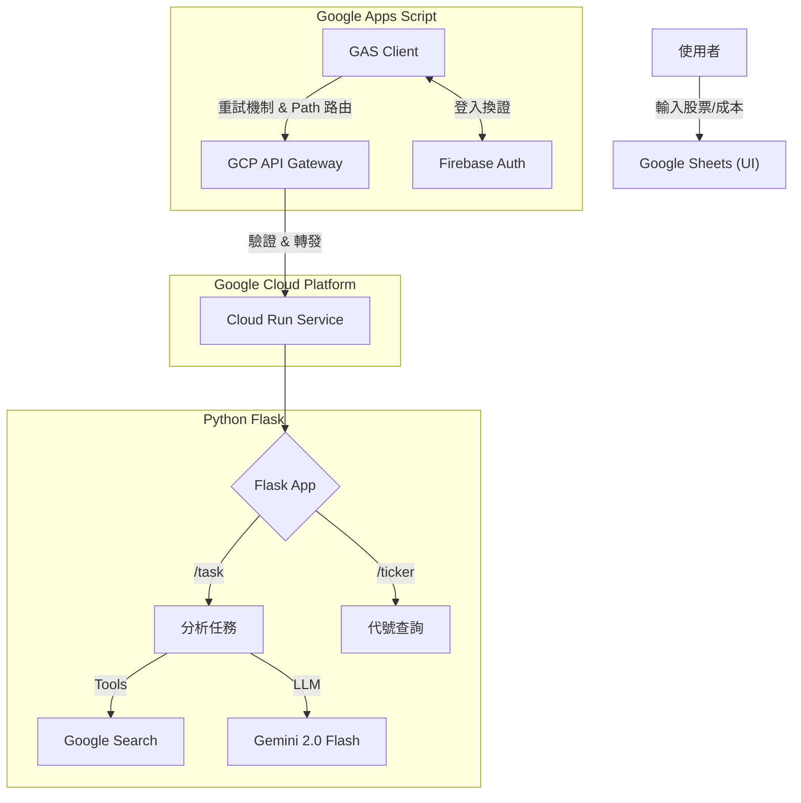

# 📈 Gemini 股票自動分析助理 (Gemini Stock Analyst - Sara Morphology)

這是一個全自動化的股票投資分析系統。透過 Google Sheets 管理持股，結合 Google Cloud Run 與 Gemini 2.0 Flash (Vertex AI)，實現「即時聯網查價」與「基本面、技術線形」策略分析，並將專業的 HTML 分析自動寄送至您的信箱。

## 🚀 核心功能 (Key Features)

* 企業級資安 (Enterprise Security)：導入 Firebase Auth 與 API Gateway，徹底封鎖後端 IP，僅允許持有有效 Token 的流量進入。
* 自動化代號補全：支援透過中文名稱精確查詢股票代號（串接 FinMind API），不再依賴 AI 猜測。
* API 重試機制：前端 GAS 加入指數退避重試邏輯，有效處理 504 Gateway Timeout 錯誤。
* 即時聯網落地 (Grounding)：整合 Google Search Tool，AI 自動檢索最新的即時股價、EPS、營收 YoY 與均線數據。
* Serverless 架構：前端使用 GAS，後端使用 Cloud Run 執行的 Flask App。
* 籌碼追蹤 (Chips)：自動抓取台股每日投信買賣超與融資餘額變化。
* 期貨對應 (Futures)：內建智能映射機制，自動將股票代號轉換為對應的主力期貨合約，並支援自動爬蟲修復。
* 可轉債分析 (Convertible Bonds)：整合櫃買中心資訊，自動計算可轉債乖離率，並透過每日下載機制保持資料最新。

## 🏗️ 系統架構 (Architecture)



## 📂 目錄結構 (Directory Structure)
```
.
├── backend/                  # Python 後端程式碼 (Flask App)
│   ├── main.py               # Flask 主路由與 API 邏輯
│   ├── data_modules/         # [新增] 市場數據模組
│   │   ├── chips.py          # 籌碼面 (TWSE T86/融資)
│   │   ├── futures.py        # 期貨行情 (自動映射主力合約)
│   │   ├── cb.py             # 可轉債資訊 (含每日自動更新對照表)
│   │   └── futures_mapping.py# 期貨代號映射邏輯
│   ├── utils/                # [新增] 通用工具模組
│   │   ├── ticker_utils.py   # 股票代號查詢工具 (FinMind)
│   │   └── stock_analysis.py # YFinance 數值分析邏輯
│   ├── scripts/              # [新增] 維護腳本
│   │   ├── update_cb_mapping.py      # 可轉債對照表更新腳本
│   │   └── update_futures_mapping.py # 期貨對照表更新腳本
│   ├── requirements.txt      # 依賴套件 (新增 openpyxl 等)
│   └── Procfile              # Gunicorn 啟動設定
├── gas/                      # Google Apps Script 前端代碼
│   └── Code.gs               # [更新] 具備重試機制與多路徑呼叫邏輯
├── prompt/                   # 策略提示詞備份
└── openapi2-run.yaml         # API Gateway 設定檔
```

## ⚙️ 部署教學 (Deployment)

### 步驟 1：部署後端 (Google Cloud Run)

進入 backend 目錄並部署至 Cloud Run (需記下 URL，後續設定 Gateway 會用到)。

```
cd backend
gcloud run deploy daily-gemini-task \
  --source . \
  --region us-central1 \
  --allow-unauthenticated \
  --set-env-vars GCP_PROJECT_ID=你的專案ID,MODEL_NAME=gemini-2.0-flash-001
```


### 步驟 2：建立安全層 (Gateway & Firebase)

* 啟用 API：啟用 API Gateway, Service Control, Service Management API。

* Firebase 設定：
    * 在 Firebase Console 建立專案。
    * 啟用 Authentication (Email/Password)。
    * 建立一個測試用帳號 (Email/Password)。
    * 取得 Web API Key。

* 設定 Gateway：
    * 修改 openapi2-run.yaml，填入 Project ID、Cloud Run URL、Firebase Issuer/Audience。
    * 執行指令建立 API Config 與 Gateway。

### 步驟 3：封鎖後門 (Lockdown)

Gateway 建立成功後，移除 Cloud Run 的公開存取權限，僅允許 Gateway 的 Service Account 呼叫。

### 步驟 4：設定策略 Prompt
* 在 Google Drive 建立一個 Google Doc。
* 將 prompt/system_prompt.txt 內容貼入檔案中。
* 記下該 Google Doc 的 File ID (網址 d/ 後面那串)。


### 步驟 5：設定前端 (Google Apps Script)

```
// ==========================================
// 1. 全域設定區
// ==========================================
const GATEWAY_URL = "[https://你的-gateway-url.gateway.dev/task](https://你的-gateway-url.gateway.dev/task)"; // 注意：這是 Gateway 網址

// Firebase 設定 (用於獲取 Token)
const FIREBASE_API_KEY = "你的_Firebase_Web_API_Key";
const FIREBASE_EMAIL = "test@example.com";
const FIREBASE_PASSWORD = "你的密碼";
const PROMPT_FILE_ID = "你的_Google_Doc_ID"; 
```

## 📖 使用說明 (Usage)

### 1. 準備表格資料

| 欄位   |   名稱      |  說明                       |
| ----- | --------    | --------                    |
| A2    | Email       | 接收報告的電子信箱            |
| A5   | 狀態        | 狀態(程式會自動更新執行進度)   |
| B     | 股票名稱     | 例如：廣達                   |
| C     | 股票代號     | 可留空，系統自動補全          |
| D     | 成本價       | 持有成本 (可選)              |


### 2. 執行功能

點選上方選單 「Gemini AI」：

* 自動填入股票代號：系統會自動登入 Firebase 取得 Token，通過 Gateway 查詢代號。

* 執行投資組合分析：觸發完整分析流程，產生 HTML 報告並寄信。

### 3. 自動化排程

在 Apps Script 設定「時間驅動」觸發器 (例如每日上午 9 點)，即可每日定時自動執行分析。

## 📝 License

This project is licensed under the MIT License.
